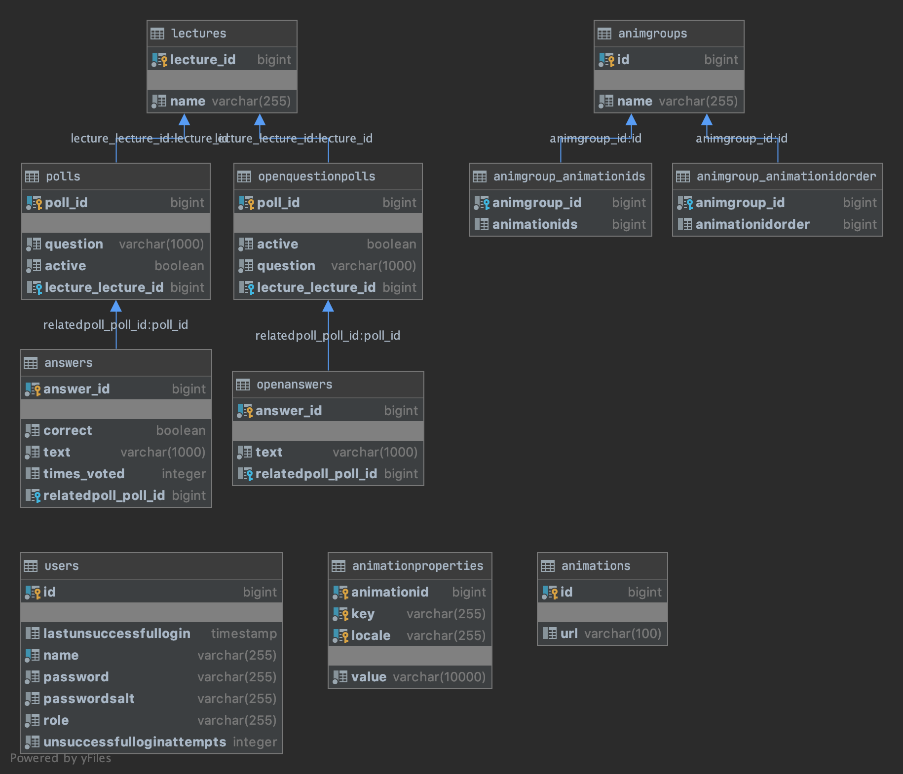

# Guide

This Guide will lead you through the development with the yaars backend server. As the server was initially build for the NetworksAnimation project, this guide will contain information that are already mentioned in the [Networks animation guide](https://sam-dev.cs.hm.edu/WEBDEV/netzwerke-animationen/-/blob/master/docs/guide/GUIDE.md).
Be aware that this document only covers yaars related topics, for information about the network animation part refer to the other guide. 


## Content

1. [Introduction](#introduction)
1. [Installation](#installation)
    - [Prerequisites](#prerequisites)
    - [Database Setup](#database-setup)
1. [Development](#development)
1. [Testing](#testing)
1. [Deployment](#deployment)
1. [Project structure](#project-structure)
1. [YAARS API](#yaars-api)
    - [Database Scheme](#database-scheme)
    - [REST API](#rest-api)
    - [STOMP over Websocket](#stomp-over-websockets)
1. [Updating Dependencies](#updating-dependencies)


## Introduction

This server was initially written as a backend for the NetworksAnimation project, but as the yaars project started it 
was extended to be used as a backend for yaars. The basic functionality of the NetworksAnimation part is still used and there's
some overlap of functionality for both projects.

The yaars project aims to provide an easy to use, open-source and self-hosted [ARS System](https://de.wikipedia.org/wiki/Audience_Response_System).
The server provides the backend logic, the databases and the API for any other component to connect. The setup of the 
development environment and the functionality of the server is explained in this guide.


## Installation

The following chapters will guide you through the installation of the development environment for the application system.


### Prerequisites

First of all, check that you have **Git** (https://git-scm.com/) installed in order to clone the repositories.

For the Server you'll need a recent Java **JDK** version (at the time of writing its Java 13).
To make sure its the correct one head over to the `build.gradle` file in the server repository's root.
The file should look something like this:


All other dependencies should be installed automatically by the server build tool **Gradle** when opening the projects in your favorite IDE.

The server is written in [Kotlin](https://kotlinlang.org) using the [Javalin Framework](https://javalin.io).

If you're using IntelliJ IDEA it is recommended to install the [detekt plugin](https://plugins.jetbrains.com/plugin/10761-detekt).
[Detekt](https://detekt.github.io/detekt/) is a static code analysis tool for
Kotlin and used to check for code smell in this project. The rules for the detekt plugin reside in the detekt-config.yml file.


### Database Setup

Since the server requires a database to be setup we'll do just that.
Head over to [https://www.postgresql.org/](https://www.postgresql.org/) and install the database server for your platform.

Once that is done create a database called `hmserver` and make sure the username is `postgres` and the password is `root`.
The server will use that one later on.

There is also the possibility to run the database in a docker container. In order to configure the mentioned database settings
the [postgres docker image](https://hub.docker.com/_/postgres) provides certain environment variables. The command to initially start a docker container with
the right configuration for the server is as followed:

`docker run --name postgres -p 5432:5432 -e POSTGRES_DB=hmserver -e POSTGRES_USER=postgres -e POSTGRES_PASSWORD=root -d postgres`

The tool psql is very helpful for the development with postgres. It provides a connection to the database and therefore
a CLI to run sql commands on the database. It's usually installed with the postgres installation, but if you're using the docker
image it's easier to install it separately. Under macOS homebrew provides the package "libq", which contains psql.

> You may wonder about the name of the database. 
> It is defined in the file at `animation-server/src/main/resources/META-INF/persistence.xml` which defines the JPA configuration. 
> A great extension of the server application would be a dynamic creation at runtime where you can specify the used database options for example by command line arguments.

## Development


### Start the server


In order to run the server you could either create a Shell or Batch script to start up your server or create an IntelliJ run configuration.


Add the following list of program arguments to the run configuration:

```
--port 4200
--debug
--jwt-salt "random string"
```

The port is self-explanatory. 
`--debug` means that it should enable functions used when developing, such as debug logging and CORS enabled for all origins.
The `--jwt-salt` argument is need for the authentication mechanism the app is using called JWT, which is short for JSON Web Tokens.

Start up the server and you should see a message like `[main] INFO io.javalin.Javalin - Javalin started in 490ms \o/` in the last line of the console.

## Testing

Currently no unit tests are used, because this project was carried out as a small side project for university without much time on hand. 
The only test method used is the manual attempt to test everything (which works at the moment because the application is still quite small).

Feel free to add unit tests!


## Deployment

Since the projects are hosted on GitLab we use a GitLab runner to continuously build and deploy the application on `www.sam.cs.hm.edu`.
See the `.gitlab-ci.yml` files in both projects to see how that's done in detail.


### Server

The server is deployed as service on the host machine.


#### Building

Build the production artifact by calling `./gradlew -Dorg.gradle.java.home=/opt/jdk-12 shadowJar`.
After success the built artifact will be located at `{SERVER_PROJECT_ROOT}/build/libs/animation-server.jar`.


#### Service

To stop the service call `sudo systemctl stop hm-animations-server.service`.

To re-start it call `sudo systemctl restart hm-animations-server.service`.

You can also see the logs of the running server by calling `journalctl -u hm-animations-server.service -b -e -f`.


#### Certificate renewal process

The servers REST API is served via HTTPS.
Thus it needs a valid certificate which we get from Let's encrypt.

The servers underlying framework Javalin uses Jetty as application server.
We register a file watcher which will listen on a keystore file (which contains the certificate and private key to use).
Once the keystore file is updated automatically once every few months the server will pick up and use the new certificate from the changed keystore.
Thus there is no downtime to the server even when running a long time.

But where does the certificate really come from?
We use an Apache HTTPD web server to serve the client application from.
The Let's Encrypt `certbot` is already registered for the Apache web server and renews automatically.
Therefore we do not need to call the certbot ourselves but just use the certificate of the Apache web server for our application server.
The current certificate and private key are always stored at `/etc/letsencrypt/live/www.sam.cs.hm.edu`.

Using a renewal hook on the certbot we call a script called `convertkeystore.sh` at `/etc/letsencrypt/renewal-hooks/post` to convert a newly fetched certificate and private key from Let's Encrypt to a keystore format which is a usable format for Java.
It copies the generated keystore to `/opt/keystore/keystore.p12` on which the file watcher of the server application is listening to.


# Project structure

In order to find where stuff belongs to it's key to understand the project structure.

The Server is a Gradle project and thus has the normal directory structure.

```
    - src
        - main
            - kotlin
                - edu.hm.cs.animation.server
                    - animation -> Logic/Model regarding animations
                    - animgroup -> Logic/Model regarding animation groups
                    - security -> Authentication of the service
                    - user -> User model and services
                    - util -> Contains utility
                        - cmdargs -> Logic behind the args to run the server
                        - file -> FileWatcher for the Certificaterenewal process
                        - rest -> Logic/Interface for the rest API 
                        - stomp -> All stomp related code (Subscription managers, STOMPFrame logic and Parsers)
                            - subscriptions -> Managers for subscribing to a ressource
                    - yaars -> Containing all yaars related code
                        - lecture -> Logic/Model regarding lectures
                        - poll -> Logic/Model regarding polls
                        - vote -> Logic/Model regarding votes
                    - Main.kt -> Entry point of the application
            - resources
                - META-INF
                    - persistence.xml -> JPA configuration
    - .gitlab-ci.yml -> Gitlab build configuration
    - build.gradle -> Gradle build configuration + Dependencies
    - CHANGELOG.md -> Short notes about new features in releases
    - detekt-config.yml -> Configuration file for detekt
    - README.md -> General information about the server project
```

## YAARS API

The yaars API provides the ability to create, query and change the yaars related databases. The following part will 
walk you through each endpoint and it's functionality.

### Database scheme

The database scheme for yaars is pretty basic and consists of three entities: lectures, polls and answers. The general idea is
that a poll is related to a certain lecture (in order to search for all open polls for a specific lecture). A poll has a question and 
multiple answers which can be correct or not and which have a certain number which represents how often somebody voted for it. The polls
are separated into two types. The first one is the classic poll with a question, and multiple, predefined answers. The answers have a status
which indicates whether they're correct or not. The second type is the so called "OpenQuestion" Poll. It's a poll with an openly asked question.
The answer type differs because the user could answer with any text they want. The answer therefore has a count how often this
specific text was answered. 

The Scheme is as followed:



The image shows the tables for the rest of the server as well (animation groups, user management, etc). 

### REST API

Each entity has its own rest endpoint which is implementing the CRUD interface (src/main/kotlin/edu.hm.cs.animation.server/util/rest).
Therefore each endpoint handles GET, POST and PATCH requests. If a certain id is provided in the path (e.g. poll/2) the 
endpoint handles GET and DELETE methods related to the column with the specified id.

The endpoints are organized as followed: 

```
- /api/yaars -> All yaars related endpoints
    - /poll -> Handles GET, POST, PATCH for polls
           - /:id -> Handles GET and DELETE for poll with id = :id
           - /vote/:idPoll/:idAnswer -> Handels voting functionality. Just handels PATCH requests. Counts as a vote for Poll with idPoll and Answer with idAnswer
    - /openpoll -> Handles GET, POST, PATCH for openpolls
           - /:id -> Handles GET and DELETE for poll with id = :id
           - /vote/:idPoll -> Handels voting functionality. Just handels PATCH requests. Counts as a vote for Poll with idPoll. The answer is then embedded in the body.
    - /lecture -> Handles GET, POST, PATCH for lectures
           - /:id -> Handels GET and DELETE for lectures with id = :id
    
```

#### Voting via the API

Voting via the REST Endpoints is also supported. For the normal poll, this is done via a ```PATCH``` request to the endpoint 
````/api/yaars/poll/vote/:idPoll/:idAnswer````. As the answers are predefined, this leads to an increase of the voting count for the answer with 
the specified id.

Voting for an open question poll is a bit more complicated as the answers are not predefined but given by the user. In general voting is also done 
with a ```PATCH``` request to the endpoint ```/api/yaars/openpoll/vote/:idPoll```. But in this case the text of the answer is embedded in the Body of
the HTTP request in form of a JSON with the field `````"text": "Answer text"`````. In case the poll already had such an answer the ```timesMentioned``` field
is increased by one. In the other case a new answer is created and attached to the current list of answers.  

### STOMP over Websocket

In order to communicate fluently with the clients, the server provides three websocket endpoints accepting STOMP requests.
STOMP is a communication protocol for websockets, you can read about it on the [offical website](http://stomp.github.io/stomp-specification-1.0.html).
This Server implements endpoints which are able to accept STOMP 1.0 requests. But be aware that not every STOMP method is
implemented. Only CONNECT, SEND, SUBSCRIBE, UNSUBSCRIBE and RECEIPT methods are accepted or send.

The endpoints are:

```
- /api/yaars
        - /poll -> Handels the creation of polls over stomp (SEND Method)
            - /:id -> Handels subscriptions to polls over stomp (SUBSCRIBE / UNSUBSCRIBE Method)
            - /vote/:idPoll/:idAnswer -> Handels voting over STOMP, votes for an answer with idPoll and idAnswer (SEND Method)
        - /lecture/:id -> Handels subscriptions to all open polls for a certain lecture. The server will send updates whenever a poll is switched active (SUBSCRIBE / UNSUBSCRIBE method)    
``` 

The idea how the Websocket functionality should be used is illustrate in this diagram: 


## Updating Dependencies

> Whenever updating dependencies please make sure to have a return point (for example a branch containing no unsaved changes) ready in case the application won't build afterwards.

The server is based on Gradle which allows to call `gradlew.bat dependencyUpdates -Drevision=release` (by using a plugin).
The commands output will show new available versions and allows you to manually edit the `build.gradle` file with the new versions.

To update Gradle itself call `gradlew.bat wrapper --gradle-version=X.X.X` where `X.X.X` is the version to update to. Afterwards the file `gradle/wrapper/gradle-wrapper.properties` file is updated to use the new version which will be downloaded and used by the next Gradle call.
